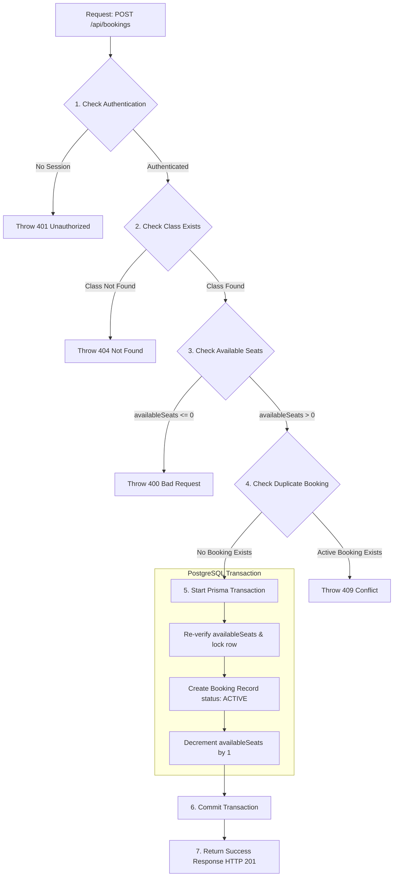

# SlotTrack - API Blueprint Documentation

> **Version:** 1.0
> **Project:** SlotTrack - Cure.fit Class Booking System
> **Base URL:** `/api`
> **Authentication:** Auth.js (NextAuth) Session Cookie
> **Response Format:** JSON (Consistent Wrapper)

---

# 1. Overview

This document specifies the REST API contract for the SlotTrack system. It serves as the single source of truth for both frontend and backend development. All endpoints, validation rules, payload formats, error responses, authentication layers, and workflows are detailed herein to guide manual or AI-assisted development.

---

# 2. API Conventions

### Base URL
All API requests are relative to the `/api` prefix of the deployment root (e.g., `http://localhost:3000/api` in local development).

### HTTP Methods
*   `GET`: Retrieves data. Idempotent and safe.
*   `POST`: Creates new resources. Non-idempotent.
*   `PATCH`: Modifies existing resources (used for partial updates and state cancellation).
*   `DELETE`: Permanently removes resources.

### Response Wrapper Format
All responses conform to a unified wrapper structure, defined by the `ApiResponse<T>` interface:

#### Success Response Suffix
```json
{
  "success": true,
  "data": {
    "key": "value"
  }
}
```

#### Error Response Suffix
```json
{
  "success": false,
  "error": "Error description explanation"
}
```

### HTTP Status Codes

| Code | Status | Usage |
| :--- | :--- | :--- |
| **200** | `OK` | The request succeeded and returned requested data in `data`. |
| **201** | `Created` | The resource creation succeeded. |
| **400** | `Bad Request` | Validation failed or inputs were structurally invalid. |
| **401** | `Unauthorized` | Credentials are missing or invalid. Session token is required. |
| **403** | `Forbidden` | Authenticated successfully, but lacks the necessary role permissions. |
| **404** | `Not Found` | The requested resource (User, FitnessClass, or Booking) does not exist. |
| **409** | `Conflict` | Business rule conflict (e.g., booking a class twice or booking a full class). |
| **501** | `Not Implemented` | Target endpoint is mapped but logic has not been fully implemented. |
| **500** | `Internal Error` | Server-side database failure or unhandled exception. |

---

# 3. Endpoint Summary Table

| Method | Endpoint | Description | Auth Required? | Allowed Roles |
| :--- | :--- | :--- | :--- | :--- |
| **POST** | `/api/auth/register` | Register a new member user | No | Anyone |
| **POST** | `/api/auth/login` | Authenticate credentials and start session | No | Anyone |
| **GET** | `/api/auth/profile` | Retrieve profile of the logged-in user | Yes | `MEMBER`, `ADMIN` |
| **PATCH** | `/api/auth/profile` | Edit details of the logged-in user | Yes | `MEMBER`, `ADMIN` |
| **GET** | `/api/classes` | Retrieve list of all fitness classes (filtered) | No | Anyone |
| **GET** | `/api/classes/:id` | Get details of a single fitness class | No | Anyone |
| **POST** | `/api/classes` | Create a new fitness class | Yes | `ADMIN` |
| **PATCH** | `/api/classes/:id` | Update an existing fitness class details | Yes | `ADMIN` |
| **DELETE** | `/api/classes/:id` | Delete a fitness class | Yes | `ADMIN` |
| **GET** | `/api/bookings` | List all bookings | Yes | `ADMIN` (All), `MEMBER` (Own) |
| **POST** | `/api/bookings` | Book a seat in a fitness class slot | Yes | `MEMBER`, `ADMIN` |
| **PATCH** | `/api/bookings/:id` | Cancel an active booking slot | Yes | `MEMBER`, `ADMIN` |
| **GET** | `/api/bookings/history` | Get paginated booking history of user | Yes | `MEMBER`, `ADMIN` |

---

# 4. Authentication Endpoints

### 4.1. Register User
*   **Path**: `POST /api/auth/register`
*   **Purpose**: Creates a new user record in the database. Defaults role to `MEMBER`.
*   **Authentication Required**: No.
*   **Validation Rules**:
    *   `name`: Non-empty string.
    *   `email`: Valid email format, unique in DB.
    *   `password`: String, minimum 6 characters.

#### Example Request Payload
```json
{
  "name": "Jane Doe",
  "email": "jane.doe@example.com",
  "password": "securePassword123"
}
```

#### Example Success Response (201 Created)
```json
{
  "success": true,
  "data": {
    "id": "cm456789123",
    "name": "Jane Doe",
    "email": "jane.doe@example.com",
    "role": "MEMBER",
    "createdAt": "2026-07-16T12:00:00.000Z"
  }
}
```

#### Example Error Response (409 Conflict - Email Exists)
```json
{
  "success": false,
  "error": "An account with this email address already exists."
}
```

---

### 4.2. Login User
*   **Path**: `POST /api/auth/login`
*   **Purpose**: Validates user credentials and sets up an Auth.js session cookie.
*   **Authentication Required**: No.
*   **Validation Rules**:
    *   `email`: Valid email format.
    *   `password`: Non-empty string.

#### Example Request Payload
```json
{
  "email": "jane.doe@example.com",
  "password": "securePassword123"
}
```

#### Example Success Response (200 OK)
```json
{
  "success": true,
  "data": {
    "user": {
      "id": "cm456789123",
      "name": "Jane Doe",
      "email": "jane.doe@example.com",
      "role": "MEMBER"
    }
  }
}
```

#### Example Error Response (401 Unauthorized)
```json
{
  "success": false,
  "error": "Invalid email or password combination."
}
```

---

### 4.3. Get Profile
*   **Path**: `GET /api/auth/profile`
*   **Purpose**: Retrieves details of the currently authenticated user session.
*   **Authentication Required**: Yes.
*   **Allowed Roles**: `MEMBER`, `ADMIN`.

#### Example Success Response (200 OK)
```json
{
  "success": true,
  "data": {
    "id": "cm456789123",
    "name": "Jane Doe",
    "email": "jane.doe@example.com",
    "role": "MEMBER",
    "createdAt": "2026-07-16T12:00:00.000Z",
    "updatedAt": "2026-07-16T12:00:00.000Z"
  }
}
```

---

### 4.4. Update Profile
*   **Path**: `PATCH /api/auth/profile`
*   **Purpose**: Updates profile properties of the authenticated user.
*   **Authentication Required**: Yes.
*   **Allowed Roles**: `MEMBER`, `ADMIN`.
*   **Validation Rules**:
    *   `name`: Optional string.
    *   `password`: Optional string, minimum 6 characters.

#### Example Request Payload
```json
{
  "name": "Jane Doe Updated",
  "password": "newSecurePassword456"
}
```

#### Example Success Response (200 OK)
```json
{
  "success": true,
  "data": {
    "id": "cm456789123",
    "name": "Jane Doe Updated",
    "email": "jane.doe@example.com",
    "role": "MEMBER",
    "updatedAt": "2026-07-16T13:30:00.000Z"
  }
}
```

---

# 5. Fitness Classes Endpoints

### 5.1. List Fitness Classes
*   **Path**: `GET /api/classes`
*   **Purpose**: Retrieves list of scheduled classes. Support optional filtering params.
*   **Authentication Required**: No.
*   **Query Params**:
    *   `category`: Optional string filter.
    *   `location`: Optional string filter.

#### Example Success Response (200 OK)
```json
{
  "success": true,
  "data": [
    {
      "id": "class101",
      "title": "Zumba Cardio",
      "description": "High-intensity Zumba fitness session",
      "instructor": "Carlos Martinez",
      "category": "Cardio",
      "imageUrl": "https://example.com/zumba.jpg",
      "location": "Downtown Center",
      "startTime": "2026-07-17T09:00:00.000Z",
      "endTime": "2026-07-17T10:00:00.000Z",
      "capacity": 30,
      "availableSeats": 28
    }
  ]
}
```

---

### 5.2. Get Class By ID
*   **Path**: `GET /api/classes/:id`
*   **Purpose**: Retrieves full info of a single class.
*   **Authentication Required**: No.
*   **Request Params**:
    *   `id`: Class ID string.

#### Example Success Response (200 OK)
```json
{
  "success": true,
  "data": {
    "id": "class101",
    "title": "Zumba Cardio",
    "description": "High-intensity Zumba fitness session",
    "instructor": "Carlos Martinez",
    "category": "Cardio",
    "imageUrl": "https://example.com/zumba.jpg",
    "location": "Downtown Center",
    "startTime": "2026-07-17T09:00:00.000Z",
    "endTime": "2026-07-17T10:00:00.000Z",
    "capacity": 30,
    "availableSeats": 28,
    "createdAt": "2026-07-16T08:00:00.000Z"
  }
}
```

#### Example Error Response (404 Not Found)
```json
{
  "success": false,
  "error": "Fitness class with ID class101 does not exist."
}
```

---

### 5.3. Create Class (Admin Only)
*   **Path**: `POST /api/classes`
*   **Purpose**: Schedules a new fitness class in the database.
*   **Authentication Required**: Yes.
*   **Allowed Roles**: `ADMIN`.
*   **Validation Rules**:
    *   `title`: String, min 3 chars.
    *   `description`: String, min 10 chars.
    *   `instructor`: String.
    *   `category`: String.
    *   `imageUrl`: String (URL format).
    *   `location`: String.
    *   `startTime`: ISO String date.
    *   `endTime`: ISO String date (must be after `startTime`).
    *   `capacity`: Positive integer.

#### Example Request Payload
```json
{
  "title": "Pilates Core Strength",
  "description": "Focuses on alignment, breathing and core strength development.",
  "instructor": "Sarah Connor",
  "category": "Strength",
  "imageUrl": "https://example.com/pilates.jpg",
  "location": "West Wing Room B",
  "startTime": "2026-07-18T15:00:00.000Z",
  "endTime": "2026-07-18T16:00:00.000Z",
  "capacity": 20
}
```

#### Example Success Response (201 Created)
```json
{
  "success": true,
  "data": {
    "id": "class102",
    "title": "Pilates Core Strength",
    "instructor": "Sarah Connor",
    "category": "Strength",
    "location": "West Wing Room B",
    "startTime": "2026-07-18T15:00:00.000Z",
    "endTime": "2026-07-18T16:00:00.000Z",
    "capacity": 20,
    "availableSeats": 20,
    "createdAt": "2026-07-16T13:30:00.000Z"
  }
}
```

---

### 5.4. Update Class (Admin Only)
*   **Path**: `PATCH /api/classes/:id`
*   **Purpose**: Partially updates scheduling or descriptive variables of a class.
*   **Authentication Required**: Yes.
*   **Allowed Roles**: `ADMIN`.
*   **Request Params**:
    *   `id`: Class ID string.
*   **Validation Rules**: Optional versions of fields in POST.

#### Example Request Payload
```json
{
  "capacity": 25,
  "location": "Grand Hall Suite"
}
```

#### Example Success Response (200 OK)
```json
{
  "success": true,
  "data": {
    "id": "class102",
    "title": "Pilates Core Strength",
    "location": "Grand Hall Suite",
    "capacity": 25,
    "availableSeats": 25,
    "updatedAt": "2026-07-16T13:32:00.000Z"
  }
}
```

---

### 5.5. Delete Class (Admin Only)
*   **Path**: `DELETE /api/classes/:id`
*   **Purpose**: Removes a class schedule record. Automatically deletes all associated Bookings.
*   **Authentication Required**: Yes.
*   **Allowed Roles**: `ADMIN`.

#### Example Success Response (200 OK)
```json
{
  "success": true,
  "data": {
    "id": "class102",
    "message": "Fitness class and all associated bookings deleted successfully."
  }
}
```

---

# 6. Bookings Endpoints

### 6.1. List Bookings (Admin / Management)
*   **Path**: `GET /api/bookings`
*   **Purpose**: List active/cancelled bookings. Admins can view all; Members can see own booking records.
*   **Authentication Required**: Yes.
*   **Allowed Roles**: `ADMIN`, `MEMBER`.

#### Example Success Response (200 OK)
```json
{
  "success": true,
  "data": [
    {
      "id": "booking301",
      "userId": "cm456789123",
      "classId": "class101",
      "status": "ACTIVE",
      "bookedAt": "2026-07-16T13:00:00.000Z",
      "class": {
        "title": "Zumba Cardio",
        "startTime": "2026-07-17T09:00:00.000Z",
        "location": "Downtown Center"
      }
    }
  ]
}
```

---

### 6.2. Create Booking
*   **Path**: `POST /api/bookings`
*   **Purpose**: Books a seat in a fitness class. Run inside a transaction.
*   **Authentication Required**: Yes.
*   **Allowed Roles**: `MEMBER`, `ADMIN`.
*   **Validation Rules**:
    *   `classId`: Non-empty string.

#### Example Request Payload
```json
{
  "classId": "class101"
}
```

#### Example Success Response (201 Created)
```json
{
  "success": true,
  "data": {
    "booking": {
      "id": "booking301",
      "userId": "cm456789123",
      "classId": "class101",
      "status": "ACTIVE",
      "bookedAt": "2026-07-16T13:00:00.000Z"
    },
    "availableSeatsRemaining": 27
  }
}
```

#### Example Error Response (409 Conflict - Duplicate booking)
```json
{
  "success": false,
  "error": "You have already booked a slot in this class."
}
```

---

### 6.3. Cancel Booking (Cancel Status Update)
*   **Path**: `PATCH /api/bookings/:id`
*   **Purpose**: Cancels an active booking slot and increments available class seats by 1.
*   **Authentication Required**: Yes.
*   **Allowed Roles**: `MEMBER` (Own booking only), `ADMIN`.
*   **Request Params**:
    *   `id`: Booking ID.

#### Example Success Response (200 OK)
```json
{
  "success": true,
  "data": {
    "id": "booking301",
    "status": "CANCELLED",
    "cancelledAt": "2026-07-16T13:40:00.000Z",
    "availableSeatsRemaining": 28
  }
}
```

---

### 6.4. Paginated Booking History
*   **Path**: `GET /api/bookings/history`
*   **Purpose**: Retrieves the paginated booking history (both active and cancelled status) of the authenticated user.
*   **Authentication Required**: Yes.
*   **Allowed Roles**: `MEMBER`, `ADMIN`.
*   **Query Params**:
    *   `page`: Number, default `1`.
    *   `limit`: Number, default `10`.

#### Example Success Response (200 OK)
```json
{
  "success": true,
  "data": {
    "records": [
      {
        "id": "booking301",
        "userId": "cm456789123",
        "classId": "class101",
        "status": "CANCELLED",
        "bookedAt": "2026-07-16T13:00:00.000Z",
        "cancelledAt": "2026-07-16T13:40:00.000Z",
        "class": {
          "title": "Zumba Cardio",
          "startTime": "2026-07-17T09:00:00.000Z"
        }
      }
    ],
    "pagination": {
      "page": 1,
      "limit": 10,
      "total": 1,
      "hasNextPage": false,
      "hasPreviousPage": false
    }
  }
}
```

---

# 7. Pagination Specification

Endpoints returning lists with potentially large volumes (like booking history) support standard query parameter pagination:

*   `page` (Query parameter): Specifies the 1-indexed page index (default: `1`).
*   `limit` (Query parameter): Size of items per page (default: `10`, maximum: `100`).

### Pagination Metadata Object
The JSON schema contains:
*   `total`: Total count of matching records.
*   `page`: Current page index.
*   `limit`: Page size.
*   `hasNextPage`: Boolean indicating if `page * limit < total`.
*   `hasPreviousPage`: Boolean indicating if `page > 1`.

#### Standard Wrapper Structure
```typescript
interface PaginatedResponse<T> {
  success: boolean;
  data: {
    records: T[];
    pagination: {
      page: number;
      limit: number;
      total: number;
      hasNextPage: boolean;
      hasPreviousPage: boolean;
    }
  }
}
```

---

# 8. Core Flows & Validation Workflows

### 8.1. Authentication Workflow

```mermaid
sequenceDiagram
    autonumber
    actor Client as Client / User
    participant Router as API Route
    participant Controller as Auth Controller
    participant Service as Auth Service
    participant Repo as User Repository
    database DB as PostgreSQL

    Note over Client, DB: User Registration Flow
    Client->>Router: POST /api/auth/register (name, email, password)
    Router->>Controller: register(payload)
    Controller->>Controller: Validate fields via Zod Schema
    Controller->>Service: createUser(name, email, plainPassword)
    Service->>Repo: Check if email exists
    Repo->>DB: SELECT * FROM "User" WHERE email = email
    DB-->>Repo: null
    Service->>Service: Hash password using bcryptjs (salt: 10)
    Service->>Repo: save(name, email, hashedPassword, role: MEMBER)
    Repo->>DB: INSERT INTO "User"
    DB-->>Repo: User record
    Repo-->>Service: User record
    Service-->>Controller: User Record (password omitted)
    Controller-->>Client: HTTP 201 Created (ApiResponse)

    Note over Client, DB: User Login Flow
    Client->>Router: POST /api/auth/login (email, password)
    Router->>Controller: login(email, password)
    Controller->>Service: verifyCredentials(email, password)
    Service->>Repo: findByEmail(email)
    Repo->>DB: SELECT * FROM "User" WHERE email = email
    DB-->>Repo: User Entity
    Service->>Service: Compare hash (bcrypt.compare)
    alt Credentials Match
        Service-->>Controller: User Session Details
        Controller->>Controller: Initiate Auth.js cookie session
        Controller-->>Client: HTTP 200 OK + Set-Cookie Header
    else Credentials Mismatch
        Service-->>Controller: Throw UnauthorizedError
        Controller-->>Client: HTTP 401 Unauthorized (ApiResponse error)
    end
```

---

### 8.2. Booking Workflow & Verification Order

When a member submits a seat request (`POST /api/bookings`), validation must be conducted in the exact order below before any resource is locked or modified. This keeps the transaction short and minimizes database locks:



#### Step-by-Step Validation Sequence

1.  **Check Authentication**: Middleware evaluates the Auth.js session cookie. If missing or invalid, throws a `401 Unauthorized` error.
2.  **Check Class Exists**: Controller parses `classId` and passes it to the booking service. The service requests the repository to fetch the fitness class. If the result is null, throws a `404 Not Found` error.
3.  **Check Available Seats**: The booking service inspects the class entity. If `class.availableSeats` is less than or equal to 0, throws a `400 Bad Request` or `409 Conflict` (Class Full).
4.  **Check Duplicate Booking**: The booking service calls `bookingRepository.findActiveBooking(userId, classId)`. If an active booking exists, throws a `409 Conflict` error (Already Booked).
5.  **Database Transaction**:
    *   Queries `prisma.$transaction`.
    *   Locks and updates the `FitnessClass` row decrementing `availableSeats` by 1.
    *   Inserts the `Booking` record containing `userId`, `classId`, and status `ACTIVE`.
    *   If database locks fail or constraints are violated, Prisma rolls back automatically.
6.  **Return Response**: On commit, returns an HTTP `201 Created` with a standardized success wrapper containing the booking details.
