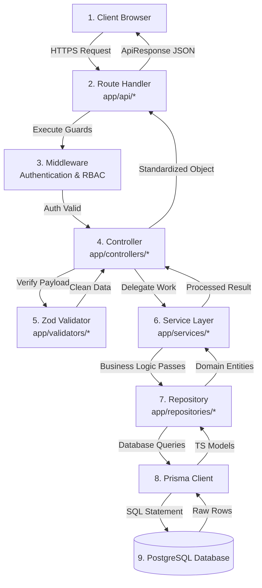
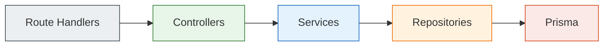
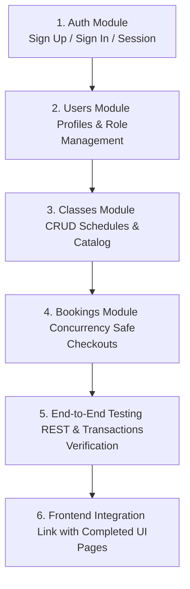

# SlotTrack - Backend Architecture Documentation

> **Version:** 1.0
> **Project:** SlotTrack - Cure.fit Class Booking System
> **Framework:** Next.js 15 (App Router)
> **Database:** PostgreSQL (Neon) with Prisma ORM
> **Language:** TypeScript (Strict Mode)

---

# 1. Project Overview

SlotTrack is a high-performance, production-quality class booking system inspired by Cure.fit. It enables users to browse fitness classes in real-time, view class schedules, check seat availability, and perform class bookings and cancellations. Administrators can manage classes, check schedules, monitor attendance, and review booking histories.

To handle high volumes of concurrent booking requests and ensure data consistency, the backend is built using a highly structured, scalable, and type-safe **Layered Architecture**. This architecture decouples HTTP routing, request validation, business rules processing, and data persistence into distinct, testable layers.

---

# 2. Technology Stack

| Layer | Technology | Purpose |
| :--- | :--- | :--- |
| **Framework** | Next.js 15 (App Router) | Serverless-ready Route Handlers and API endpoints |
| **Language** | TypeScript (Strict) | Absolute type safety across all layers and schemas |
| **Database** | PostgreSQL (Neon) | Scalable, serverless relational database |
| **ORM** | Prisma ORM | Type-safe database queries, schema management, and migrations |
| **Authentication** | Auth.js (NextAuth) | Secure session management, JWT auth, and role checking |
| **Validation** | Zod | Runtime schema validation for request payloads and query params |
| **Cryptography** | bcryptjs | Hashing passwords before storing them in PostgreSQL |

---

# 3. Folder Structure & Responsibilities

The backend codebase resides inside the `app/` folder (alongside Next.js route structures) and the root `prisma/` folder. Below is the structure and the clear responsibility assigned to each directory:

```text
slottrack/
│
├── prisma/
│   ├── schema.prisma          # Database schema and relationships definitions
│   └── migrations/            # Auto-generated SQL schema migrations
│
└── app/
    ├── api/                   # Next.js Route Handlers (REST API entry points)
    │   ├── auth/              # Auth endpoints (Register, Login, Session)
    │   ├── bookings/          # Booking endpoints
    │   └── classes/           # Class endpoints
    │
    ├── controllers/           # Orchestration layer (validators execution and delegation)
    │   ├── auth.controller.ts
    │   ├── booking.controller.ts
    │   ├── class.controller.ts
    │   └── user.controller.ts
    │
    ├── services/              # Business Logic Layer (core rules, checks, calculations)
    │   ├── auth.service.ts
    │   ├── booking.service.ts
    │   ├── class.service.ts
    │   └── user.service.ts
    │
    ├── repositories/          # Data Access Layer (Prisma client database operations)
    │   ├── auth.repository.ts
    │   ├── booking.repository.ts
    │   ├── class.repository.ts
    │   └── user.repository.ts
    │
    ├── validators/            # Zod validation schemas and payload checkers
    │   ├── auth.validator.ts
    │   ├── booking.validator.ts
    │   └── class.validator.ts
    │
    ├── middlewares/           # Endpoint auth guards and RBAC role checkers
    │   ├── auth.middleware.ts
    │   └── role.middleware.ts
    │
    ├── types/                 # Domain-wide interface and type definitions
    │   ├── api.ts
    │   ├── booking.ts
    │   ├── fitness-class.ts
    │   └── user.ts
    │
    ├── lib/                   # Utility instances and core shared libraries
    │   ├── prisma.ts          # Singleton PrismaClient instance
    │   ├── auth.ts            # Auth.js helper configurations
    │   └── utils.ts           # Shared utility functions
    │
    └── generated/             # Auto-generated Prisma client types
```

---

# 4. Backend Request Lifecycle

Every API request follows a strict, one-directional flow. The layers are executed in the sequence below:



### Responsibility of Every Layer

1. **Client**: Initiates an HTTP request with headers, credentials, parameters, or JSON payloads.
2. **Route Handler (`app/api/`)**: Next.js 15 entry point. Extracts query params, body data, and dynamic URL route params. Passes execution context to the Controller and handles output serialization.
3. **Middleware**: Checks auth tokens and roles (e.g., Member vs. Admin). Throws unauthorized or forbidden errors early.
4. **Controller (`app/controllers/`)**: Acts as an orchestrator. Validates data formats using the validator layer. If valid, delegates the parameters to the service layer. Controllers must remain "thin" and contain no business logic.
5. **Validator (`app/validators/`)**: Uses Zod to assert runtime type safety and payload correctness (e.g., valid email, string length, positive numbers, non-empty text).
6. **Service (`app/services/`)**: The core of the system. Enforces all domain rules, business workflows, calculations, and consistency checks (e.g., checking if seats are available before creating a booking, verifying if a class date has already passed).
7. **Repository (`app/repositories/`)**: Abstracts database queries. Directly interacts with `prisma` context. Contains SQL-equivalent operations (CRUD operations, relational fetches). No business logic allowed.
8. **Prisma Client**: Synthesizes type-safe queries, handles connection pools, and parses DB results into TypeScript records.
9. **PostgreSQL**: Stores the system's persistent records with appropriate transactional safety.

---

# 5. Database Architecture

The data layer uses three core relational tables and two enums defined in `prisma/schema.prisma`.

```mermaid
erDiagram
    USER ||--o{ BOOKING : "places"
    FITNESS_CLASS ||--o{ BOOKING : "receives"

    USER {
        string id PK
        string name
        string email UK
        string password
        Role role
        datetime createdAt
        datetime updatedAt
    }

    FITNESS_CLASS {
        string id PK
        string title
        string description
        string instructor
        string category
        string imageUrl
        string location
        datetime startTime
        datetime endTime
        int capacity
        int availableSeats
        datetime createdAt
        datetime updatedAt
    }

    BOOKING {
        string id PK
        string userId FK
        string classId FK
        BookingStatus status
        datetime bookedAt
        datetime cancelledAt
        datetime createdAt
    }
```



### Database Models

#### 1. User
Represents users registerable in the application. Can hold either a `MEMBER` or an `ADMIN` role.
*   **Unique Constraint**: `email` must be unique.
*   **Relationship**: Has a one-to-many relationship with the `Booking` model.

#### 2. FitnessClass
Represents a scheduled class with an instructor, timing details, location, and capacity.
*   **Tracking Fields**: Tracks total `capacity` and dynamic `availableSeats` to ensure seat limits are not exceeded.
*   **Relationship**: Has a one-to-many relationship with the `Booking` model.

#### 3. Booking
Represents the relationship between a user and a fitness class slot.
*   **Composite Unique Constraint**: `@@unique([userId, classId])` ensures that a user can book a specific class slot only once.
*   **Cascade Delete**: When a `User` or `FitnessClass` is deleted, related booking records are automatically cascade-deleted.

### Database Enums

#### 1. Role
Defines authorization privileges within the system:
*   `MEMBER`: Default. Allows booking and cancelling classes, and viewing own booking history.
*   `ADMIN`: Allows CRUD operations on users and classes, scheduling timetables, and monitoring overall bookings.

#### 2. BookingStatus
Defines the state of a reservation:
*   `ACTIVE`: Booking is valid and active.
*   `CANCELLED`: Booking has been cancelled by the user or admin, freeing up the class slot.

---

# 6. Dependency Flow & Architecture Constraints

To maintain modularity and code clarity, dependency flow rules must be strictly enforced.



### Architectural Constraints Checklist

*   **Controllers may only call Services**: A controller is never permitted to query a repository directly, nor call another controller.
*   **Services may only call Repositories**: A service cannot invoke Prisma client operations directly. It must fetch and save data using Repository methods.
*   **Repositories are the Only Prisma Gateway**: The Prisma client must only be imported and called inside files matching `*.repository.ts`.
*   **Validation Must Precede Business Logic**: Controllers must run validation schemas on incoming data before passing it down to the service layer.
*   **Controllers Must Remain Thin**: Controllers must only read inputs, call validators, call services, and handle basic output mapping. No database operations or business calculations are allowed here.
*   **Services Must House All Business Rules**: Any rule, check, check-before-save, role checking logic, or transaction workflow belongs inside `*.service.ts`.
*   **Repositories Must Only Transact with DB**: No business decision checks are allowed inside repositories. They only execute CRUD or custom SQL operations.

---

# 7. Project Coding Standards

All contributors and AI development assistants must adhere to the following rules:

1.  **Strict TypeScript**:
    *   No usage of `any`. Declare interfaces or use types exported from the Prisma generated client (`UserType`, `BookingType`, `FitnessClassType`).
    *   Explicit return types must be declared for all exported controller, service, and repository methods.
2.  **No Duplicated Business Logic**:
    *   Shared validation rules (like slot conflicts or session authentication checks) must be centralized in service layers or reusable validator rules.
3.  **Strict Layer isolation**:
    *   Do not import `prisma` from `@/app/lib/prisma` anywhere except inside repositories.
    *   Do not instantiate HTTP responses (`NextResponse`) outside Route Handlers (`app/api/...`). Controllers and Services should return raw JS objects/types and throw errors when things go wrong.
4.  **Proper Error Handling**:
    *   Create domain-specific custom errors (e.g., `NotFoundError`, `ConflictError`, `ValidationError`).
    *   Catch errors in route handlers and parse them to map to appropriate HTTP status codes (e.g., 400 for validation/conflict, 404 for not found, 401 for unauthorized).
5.  **Consistent API Responses**:
    *   Every response must implement the `ApiResponse<T>` interface:
        ```typescript
        export interface ApiResponse<T = any> {
          success: boolean;
          data?: T;
          error?: string;
        }
        ```

---

# 8. Implementation Conventions

### Naming Conventions

*   **File Naming**: Lowercase with dot-notation suffix corresponding to the layer:
    *   `auth.controller.ts`
    *   `booking.service.ts`
    *   `class.repository.ts`
    *   `booking.validator.ts`
*   **Variable/Folder Naming**: `camelCase` for directories and helper variables.
*   **Class/Type Naming**: `PascalCase` for Interfaces and Custom Types.

### Export Style

Every layer file should export a single, named constant object containing async functions. This maintains consistency and simplifies mocking during unit testing.

```typescript
// Example: class.service.ts
import { classRepository } from '../repositories/class.repository';
import { FitnessClassType } from '../types/fitness-class';

export const classService = {
  async getClasses(): Promise<FitnessClassType[]> {
    return classRepository.findAll();
  }
};
```

### Async Patterns

*   Always use `async/await` rather than Promise chain `.then()` or `.catch()`.
*   Use `Promise.all()` for parallel, non-dependent operations to optimize performance.

### Validation Flow

*   Create Zod schemas in `app/validators/`.
*   Parse incoming JSON bodies or query parameters inside the controller.
*   If validation fails, throw a custom `ValidationError` so that the Route Handler catches it and responds with `400 Bad Request`.

```typescript
// Example validator
import { z } from 'zod';

export const createClassSchema = z.object({
  title: z.string().min(3),
  description: z.string().min(10),
  capacity: z.number().int().positive(),
  startTime: z.string().datetime(),
  endTime: z.string().datetime()
});
```

### API Response Examples

#### Success Response (HTTP 200/201)
```json
{
  "success": true,
  "data": {
    "id": "cm123456789",
    "title": "Yoga Morning Flow",
    "availableSeats": 19
  }
}
```

#### Error Response (HTTP 400/404/500)
```json
{
  "success": false,
  "error": "The selected class is already fully booked."
}
```

---

# 9. Concurrency & Booking Transactions

To prevent race conditions (e.g., two users booking the last remaining seat simultaneously, resulting in overbooking or negative available seats), booking requests must be handled inside an atomic, isolated database transaction.

### Step-by-Step Booking Transaction Sequence

```mermaid
sequenceDiagram
    autonumber
    actor Client as Client / User
    participant Handler as Route Handler / Controller
    participant Service as Booking Service
    participant Repo as Booking/Class Repository
    database Postgres as PostgreSQL (Neon DB)

    Client->>Handler: POST /api/bookings { classId }
    Handler->>Handler: Validate Auth & Payload
    Handler->>Service: bookClass(userId, classId)
    
    rect rgb(240, 248, 255)
        Note over Service, Postgres: Prisma Interactive Transaction Starts ($transaction)
        
        Service->>Repo: Check class availability & lock row (Pessimistic Read)
        Repo->>Postgres: SELECT * FROM "FitnessClass" WHERE id = classId FOR UPDATE
        Postgres-->>Repo: FitnessClass details (capacity, availableSeats)
        
        alt availableSeats <= 0
            Note over Service: Available seats check fails
            Service-->>Handler: Throw ClassFullError
            Note over Service, Postgres: Transaction Rolls Back automatically
        else availableSeats > 0
            Service->>Repo: Check for duplicate active booking
            Repo->>Postgres: SELECT * FROM "Booking" WHERE userId = userId AND classId = classId
            Postgres-->>Repo: Booking record (if exists)
            
            alt Active Booking Exists
                Note over Service: Duplicate booking check fails
                Service-->>Handler: Throw DuplicateBookingError
                Note over Service, Postgres: Transaction Rolls Back automatically
            else No Active Booking
                Service->>Repo: Create Booking Record (status: ACTIVE)
                Repo->>Postgres: INSERT INTO "Booking" (userId, classId, status)
                Postgres-->>Repo: Created Booking object
                
                Service->>Repo: Decrement Class Seats by 1
                Repo->>Postgres: UPDATE "FitnessClass" SET availableSeats = availableSeats - 1 WHERE id = classId
                Postgres-->>Repo: Updated Class object
                
                Note over Service, Postgres: Transaction Commits successfully
            end
        end
    end

    Service-->>Handler: Return Booking Object
    Handler-->>Client: HTTP 201 { success: true, data: booking }
```

### Implementing Prisma Transactions

Interactive transactions are executed using `prisma.$transaction`. Ensure the logic inside:
1.  Performs the query to retrieve current capacity.
2.  Throws an error if `availableSeats` is less than or equal to 0.
3.  Checks if a active booking already exists.
4.  Performs both writes (create booking + decrement class seats) within the transaction scope.
5.  If any step throws an error, Prisma automatically rolls back all actions taken inside that block.

---

# 10. Development Workflow & Implementation Order

When building or extending SlotTrack modules, developer implementation must follow a bottom-up, feature-by-feature progression:

```text
Database Setup (schema.prisma) ➔ Repository Layer ➔ Service Layer ➔ Controller Layer ➔ Route Handlers ➔ Integration
```

### Feature Module Sequencing

To ensure smooth integration and minimize dependency blocking, developers must implement features in the following order:



#### 1. Auth Module
*   Set up Prisma schemas for User credentials.
*   Implement JWT tokens, signup schemas, password encryption, login routes, and auth state queries.

#### 2. Users Module
*   Implement basic user profile retrieval and editing.
*   Create Admin-only controllers to query members and edit member roles.

#### 3. Classes Module
*   Develop Fitness Class CRUD endpoints.
*   Enforce Role-based access control (RBAC): only Admins can create/edit/delete classes. Members can only browse them.

#### 4. Bookings Module
*   Implement transaction-safe class reservation and cancellation routines.
*   Verify seat counts are decremented or incremented accurately.

#### 5. Testing
*   Verify modules with integration tests (or Postman checks).
*   Test race conditions with concurrent requests to class slots to ensure no overbooking occurs.

#### 6. Integration
*   Connect route handler endpoints to the completed Next.js frontend UI components.
