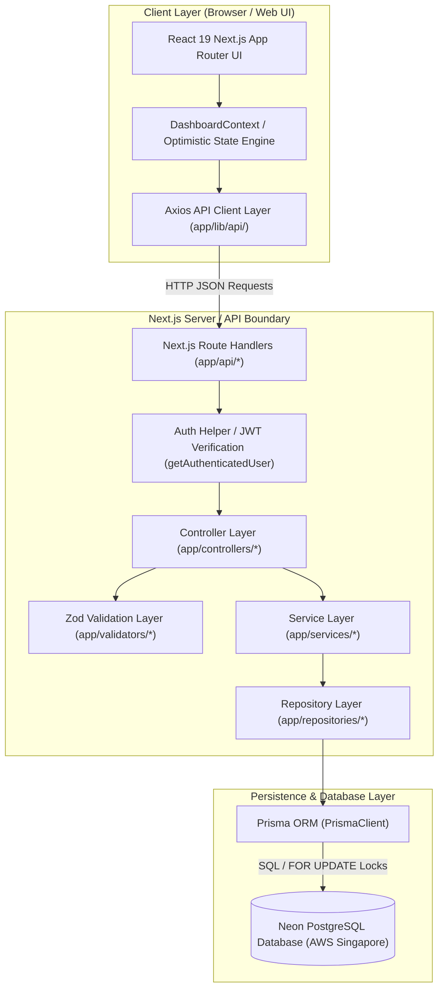
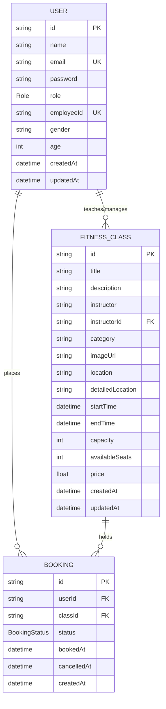

# SlotTrack — High-Level Design (HLD)

> **Product Name:** SlotTrack  
> **Team:** Byte3 (Kalvium Simulated Work Integration — Track 1)  
> **Document Version:** 2.0  
> **Status:** Verified System Architecture Audit  

---

## 1. System Overview

**SlotTrack** is designed as a unified, full-stack Next.js web application utilizing a strictly decoupled **Layered Backend Architecture** backed by a relational **PostgreSQL** database managed via **Prisma ORM**.

The system handles real-time fitness class availability, concurrency-safe seat booking, idempotent cancellations, user authentication, and admin class scheduling. To ensure responsiveness over WAN network connections, the architecture combines server-side atomic transactions with client-side optimistic UI state management.

---

## 2. System Architecture Diagram



---

## 3. Technology Stack

| Layer / Subsystem | Technology | Version | Primary Responsibility |
| :--- | :--- | :--- | :--- |
| **Framework** | Next.js (App Router) | `16.2.10` | Full-stack routing, SSR, API Route Handlers |
| **UI Library** | React | `19.2.4` | Component tree, hooks, optimistic UI rendering |
| **Styling** | Vanilla CSS + Tailwind CSS | `4.x` | Modern UI styling, flex/grid layouts, responsiveness |
| **Database** | PostgreSQL (Neon) | Serverless PG | Relational data storage, unique constraints, row locks |
| **ORM** | Prisma ORM | `7.8.0` | Type-safe queries, migration management, schema definitions |
| **Authentication** | NextAuth.js | `4.24.14` | Credentials authorization, JWT session encoding/decoding |
| **Cryptography** | bcrypt | `6.0.0` | Password hashing (10 salt rounds) |
| **Validation** | Zod | `4.4.3` | Schema definition & runtime request payload validation |
| **HTTP Client** | Axios | `1.18.1` | Client-side API request wrappers & error handling |
| **Containerization** | Docker | Node 20 Alpine | Multi-stage production container build |

---

## 4. Major System Components

### 4.1 Client UI Layer (`app/components/`, `app/(dashboard)/`)
- **Dashboard Layout (`layout.tsx`):** Maintains global client context (`DashboardContext`), orchestrates optimistic booking/cancellation state, and manages profile drawers.
- **Booking Dashboard (`dashboard/page.tsx`):** Displays class grid, location filters, category tabs, and real-time seat badges.
- **Instructor Dashboard (`admin/page.tsx`):** Admin control panel providing optimistic class creation, editing, deletion, and past timetable history.
- **Profile Drawer (`ProfileDrawer.tsx`):** Displays user metadata and paginated personal booking history.

### 4.2 API & Middleware Layer (`app/api/`, `app/lib/auth-helper.ts`)
- Serves as the entry point for HTTP requests.
- Extracts headers, cookies, query parameters, and JSON request bodies.
- Decodes JWT tokens via `getAuthenticatedUser()` checking `Authorization: Bearer`, session cookies, or custom `x-user-id` headers.

### 4.3 Controller Layer (`app/controllers/`)
- Pure orchestrator layer (`auth.controller.ts`, `booking.controller.ts`, `class.controller.ts`, `user.controller.ts`).
- Passes incoming payloads through Zod validation schemas (`app/validators/`).
- Delegates cleaned payloads to the Service Layer and formats standard JSON API responses.

### 4.4 Service Layer (`app/services/`)
- Houses all core business rules and domain logic.
- Verifies seat availability, checks user permissions, enforces role restrictions, and hashes passwords.

### 4.5 Repository Layer (`app/repositories/`)
- Isolates Prisma ORM database queries (`booking.repository.ts`, `class.repository.ts`, etc.).
- Executes atomic interactive transactions (`prisma.$transaction`) and explicit raw SQL row locking (`FOR UPDATE`).

---

## 5. Major Data Flows

### 5.1 Booking Sequence Diagram (Concurrency-Protected Flow)

```mermaid
sequenceDiagram
    autonumber
    actor Client as User Browser
    participant Context as DashboardContext (Optimistic UI)
    participant Route as Route Handler (POST /api/bookings)
    participant Controller as BookingController
    participant Service as BookingService
    participant Repo as BookingRepository
    database DB as PostgreSQL (Neon)

    Client->>Context: Click "Book Slot"
    Context->>Context: Instantly add Temp Booking & Decrement Optimistic Seats (-1)
    Context->>Route: POST /api/bookings { classId }
    Route->>Controller: createBooking(req)
    Controller->>Service: createBooking(userId, classId)
    Service->>Repo: createBookingWithSeatDecrement(userId, classId)
    
    rect rgb(240, 248, 255)
        Note over Repo, DB: Interactive Transaction Starts ($transaction)
        Repo->>DB: SELECT id, capacity, "availableSeats" FROM "FitnessClass" WHERE id = classId FOR UPDATE
        DB-->>Repo: Class Row Locked
        alt Available Seats <= 0
            Repo-->>Service: Throw ConflictError ("Class fully booked")
            Note over Repo, DB: Transaction Aborts & Rolls Back
        else Available Seats > 0
            Repo->>DB: SELECT * FROM "Booking" WHERE userId = userId AND classId = classId AND status = 'ACTIVE'
            alt Active Booking Exists
                Repo-->>Service: Throw ConflictError ("Already booked")
            else Clean Slot
                Repo->>DB: INSERT INTO "Booking" (userId, classId, status = 'ACTIVE')
                Repo->>DB: UPDATE "FitnessClass" SET "availableSeats" = availableSeats - 1 WHERE id = classId
                DB-->>Repo: Transaction Commits Successfully
            end
        end
    end

    Repo-->>Service: Return Booking & Remaining Seats
    Service-->>Controller: Return Result
    Controller-->>Route: HTTP 201 Created { success: true, data: booking }
    Route-->>Client: Response Received
    Context->>Context: Reconcile Optimistic State with Server Data
```

---

## 6. Booking Concurrency Architecture

To achieve zero overbooking under high concurrent load, SlotTrack implements a 3-layer protection strategy:

```
Layer 1: Frontend Optimistic Lock (Disables duplicate clicks via pendingMutations Set)
  └─ Layer 2: Application Transaction Lock (Pessimistic Row Lock: SELECT ... FOR UPDATE)
      └─ Layer 3: Database Schema Constraint (Unique Index: @@unique([userId, classId]))
```

1. **Pessimistic Row Locking (`FOR UPDATE`):** Inside `bookingRepository.createBookingWithSeatDecrement`, the repository queries the target `FitnessClass` row using `$queryRaw` with `FOR UPDATE`. This forces concurrent transactions targeting the same class to block at the database wire level until the holding transaction completes.
2. **Atomic Read-Modify-Write:** The seat validation (`availableSeats > 0`), booking record creation/reactivation, and seat count update occur strictly within the locked transaction boundary.
3. **Database Unique Index Guard:** `Booking` model contains `@@unique([userId, classId])`. If concurrent code somehow bypasses application checks, PostgreSQL throws a unique constraint violation (error code `P2002`), preventing duplicate active bookings.

---

## 7. Optimistic UI Architecture

To eliminate WAN network latency overhead (60ms–70ms RTT per query to Neon PostgreSQL), SlotTrack implements client-side optimistic state management inside `DashboardLayout` and `AdminDashboardPage`:

```
User Action (Click Book / Cancel / Create)
  │
  ├── 1. Immediately Update React State (<10ms)
  │      ├─ UI updates button text / badge state
  │      ├─ Increments/decrements local seat counters (optimisticSeatDeltas)
  │      └─ Adds target ID to pendingMutations Set (prevents duplicate clicks)
  │
  ├── 2. Execute Asynchronous API Request
  │
  ├── 3. SUCCESS PATH ──► Reconcile state with server response ➔ Clear pending mutation
  │
  └── 4. FAILURE PATH ──► Roll back state snapshot (prevBookings, prevDeltas)
                         └─ Display error notification via Toast component
```

---

## 8. Database Architecture

### 8.1 Entity-Relationship Diagram (ERD)



### 8.2 Database Indexes Summary

| Table | Index Name / Type | Columns | Purpose |
| :--- | :--- | :--- | :--- |
| `User` | Unique Index | `email` | Fast authentication lookup & duplicate email prevention |
| `User` | Unique Index | `employeeId` | Optional employee ID lookup |
| `FitnessClass` | B-Tree Index | `startTime` | Rapid filtering for upcoming vs past classes |
| `FitnessClass` | B-Tree Index | `location` | Rapid city filtering |
| `FitnessClass` | B-Tree Index | `instructorId` | Admin dashboard class ownership filtering |
| `Booking` | Composite Unique | `[userId, classId]` | Prevents duplicate user reservations per class |
| `Booking` | B-Tree Index | `userId` | Fast member booking schedule & history retrieval |
| `Booking` | B-Tree Index | `classId` | Rapid seat count aggregation per class |
| `Booking` | B-Tree Index | `status` | Rapid filtering of ACTIVE vs CANCELLED bookings |

---

## 9. Deployment Architecture

```mermaid
flowchart LR
    Developer[Developer Push] -->|Git Push| GitHub[GitHub Repository]
    GitHub -->|Vercel Integration| Vercel[Vercel Serverless Edge Network]
    Vercel -->|Next.js App Engine| App[SlotTrack Serverless Runtime]
    App -->|Prisma PG Pool | Neon[Neon Serverless PostgreSQL (Singapore)]
```

### 9.1 Live Production Environment
- **Web App / Application Server:** Deployed on **Vercel** serverless platform running Next.js 16 standalone build.
- **Database Server:** Deployed on **Neon Serverless PostgreSQL** hosted in AWS Singapore (`ap-southeast-1.aws.neon.tech`).

### 9.2 Dockerization Support
The repository includes a production-grade multi-stage `Dockerfile` (Node 20 Alpine) and `docker-compose.yml` for local containerized deployment exposing port `3000:8080`.

---

## 10. Architectural Decisions & Trade-Offs

1. **Full-Stack Next.js vs Separated Microservices:**
   - *Decision:* Build as a single Next.js full-stack repository.
   - *Rationale:* Eliminates cross-origin CORS overhead, simplifies deployment, and allows shared TypeScript types across frontend and API route handlers.
2. **Pessimistic Row Locking (`FOR UPDATE`) vs Distributed Redis Lock:**
   - *Decision:* Use PostgreSQL `FOR UPDATE` row locks inside Prisma transactions.
   - *Rationale:* Eliminates extra infrastructure dependencies (Redis) while providing absolute transactional integrity directly inside PostgreSQL.
3. **Optimistic Client State vs Server Polling:**
   - *Decision:* Implement optimistic UI updates with automatic rollback.
   - *Rationale:* Bypasses WAN database latency (~65ms per RTT) to deliver sub-10ms UI responsiveness for booking and cancellation actions.
