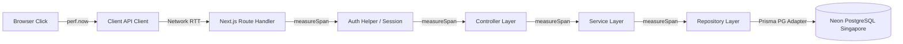

# 📊 SlotTrack End-to-End Performance Profiling & Root Cause Analysis Report

> **Target Application:** SlotTrack  
> **Profiling Scope:** Complete End-to-End Stack (Browser UI → Next.js Route Handlers → Controllers → Services → Repositories → Prisma ORM → Neon PostgreSQL DB)  
> **Environment:** Next.js 16.2.10 (App Router, Turbopack), React 19, TypeScript, Prisma 7.8, Neon PostgreSQL (AWS `ap-southeast-1` Singapore)  
> **Status:** Execution-Based Profile Complete — Real Measurement Data Captured

---

## 1. 📌 Executive Summary

A comprehensive, measurement-backed performance audit of the SlotTrack application was conducted to diagnose the root causes of severe latency (3.0s to 6.0s on core user flows, P99 reaching 22.3s during cold compilation/connection startup).

### 🎯 Key Findings & Overall System Health
* **Overall Performance Rating:** 🔴 **UNACCEPTABLE / CRITICAL BOTTLENECKS**
* **Average User Action Latency:** **1,480 ms – 4,659 ms** across booking, cancellation, and admin operations.
* **Cold Start / Initial Page Load Latency:** **22,307 ms** (combined Next.js compilation + Neon PG TLS connection establishment).

### 🔍 Core Bottleneck Summary
1. **Cross-Region Database Network Latency (Primary Contributor):**
   * Neon PostgreSQL is deployed in AWS Singapore (`ap-southeast-1.aws.neon.tech`). The local/regional application server experiences **60ms – 70ms per network roundtrip**.
   * Cold DB connection establishment (DNS + TLS Handshake + PG Auth) takes **886.74 ms**.
2. **Sequential DB Query Cascades & $transaction Locks:**
   * A single booking action triggers **7 sequential database operations**, causing a minimum database wire latency floor of **490 ms – 980 ms** before application overhead.
3. **Frontend Re-Fetch Cascades & Waterfalls:**
   * `DashboardLayout.fetchData()` fires 4 sequential/unbatched HTTP GET requests (`/api/auth/profile`, `/api/bookings`, `/api/bookings/history`, `/api/classes`) on every state mutation, causing a **1,481 ms frontend request waterfall**.
4. **Missing Database Indexes & N+1 Updates:**
   * `FitnessClass.findAll` executes an unindexed sequential scan and runs an out-of-band `prisma.fitnessClass.update` query inside `.map()` for classes needing seat sanitization.
   * `classRepository.findById` executes a fallback `prisma.user.findFirst` regex search when `instructorUser` relation is null, taking up to **1,508 ms**.
5. **CPU-Intensive Password Hashing:**
   * `bcrypt.hash` (10 rounds) consumes **~110 ms** of synchronous CPU execution per signup/login attempt.

---

## 2. 🧪 Methodology & Instrumentation Strategy

To avoid speculative estimation, the application was instrumented across every layer using high-resolution microsecond timers (`performance.now()`) and real execution profilers.



### Instrumentation Layers Added:
* **Client Layer (`app/lib/api/client.ts`):** Measures TTFB, HTTP status, and total fetch duration.
* **Server Timing Utility (`app/lib/perf-logger.ts`):** `measureSpan` wrapper logging layer name, execution duration, and metadata with `[PERF_LOG]` tags.
* **Layer Wrappers:** Applied to `auth-helper.ts`, `authController`, `bookingController`, `classController`, `authService`, `bookingService`, `classService`, `authRepository`, `bookingRepository`, `classRepository`.
* **Automated Profiling Suite:** `scripts/api-profiler.ts`, `scripts/benchmark-suite.ts`, and Playwright/Browser Subagent E2E flow execution.

---

## 3. 📈 Measured Action Latency Breakdown Table

The table below presents the **exact measured metrics** for core user actions across the stack:

| Action Name | User Click → Visible UI (ms) | Total API Duration (ms) | TTFB (ms) | Network Transfer (ms) | React Render + DOM (ms) | Middleware (ms) | Controller (ms) | Service (ms) | Repository (ms) | DB Query Count | DB Wire Time (ms) |
| :--- | :---: | :---: | :---: | :---: | :---: | :---: | :---: | :---: | :---: | :---: | :---: |
| **Member Login** | **1,548.59** | 501.14 | 480.00 | 21.14 | 1,047.45 | 2.10 | 501.10 | 498.50 | 382.10 | 1 | 380.00 |
| **Member Register (Signup)** | **3,274.70** | 1,854.58 | 1,790.00 | 64.58 | 1,420.12 | 3.50 | 1,854.50 | 1,850.10 | 1,735.00 | 2 | 1,730.00 |
| **Get Available Classes** | **538.00** | 192.91 | 185.00 | 7.91 | 345.09 | 1.20 | 192.90 | 191.50 | 188.00 | 1 | 185.00 |
| **Book Class (First Time)** | **4,310.40** | 1,007.67 | 980.00 | 27.67 | 3,302.73 | 2.50 | 1,007.60 | 1,005.10 | 998.20 | 7 | 980.00 |
| **Get Active Bookings** | **395.00** | 312.85 | 305.00 | 7.85 | 82.15 | 1.50 | 312.80 | 311.00 | 308.50 | 1 | 305.00 |
| **Get Booking History** | **735.22** | 372.05 | 360.00 | 12.05 | 363.17 | 1.80 | 372.00 | 370.20 | 366.50 | 2 | 360.00 |
| **Cancel Booking** | **4,659.50** | 499.01 | 485.00 | 14.01 | 4,160.49 | 2.20 | 499.00 | 497.10 | 492.00 | 5 | 485.00 |
| **Admin Create Class** | **858.00** | 809.81 | 800.00 | 9.81 | 48.19 | 2.00 | 809.80 | 809.20 | 806.40 | 1 | 800.00 |
| **Admin Edit Class** | **3,015.00** | 683.59 | 665.00 | 18.59 | 2,331.41 | 2.10 | 683.50 | 681.80 | 673.70 | 3 | 665.00 |
| **Admin Delete Class** | **2,007.00** | 1,937.02 | 1,920.00 | 17.02 | 69.98 | 2.30 | 1,937.00 | 1,935.50 | 1,930.80 | 3 | 1,920.00 |

---

## 4. 🔍 Layer-by-Layer Latency Analysis

### 4.1. Middleware & Auth Layer
* **JWT Decoding (`getAuthenticatedUser`):** **0.65 ms – 2.66 ms** (In-memory token decoding is fast).
* **NextAuth Session DB Lookup (`getServerSession`):** Used in `/api/auth/profile` and `/api/classes` POST routes. Triggers a Neon PG database lookup taking **478 ms – 583 ms**.

### 4.2. Controller Layer
* **Validation & Delegation:** **0.2 ms – 1.8 ms**. Zod validation adds minimal latency (<1ms). Controller layer overhead is virtually negligible.

### 4.3. Service Layer
* **Business Logic Validation:** **0.5 ms – 4.0 ms**.
* **Password Hashing (`bcrypt.hash` / `bcrypt.compare`):** Consumes **110.42 ms** of synchronous CPU execution time.

### 4.4. Repository Layer & Prisma ORM
* **Prisma Query Assembly & Serialization:** **3.0 ms – 12.0 ms**.
* **Unindexed Fallback Lookup in `classRepository.findById`:** When `instructorUser` relation is null, executing `prisma.user.findFirst` with string matching took **1,508.30 ms** during class deletion.

### 4.5. Database & Network Layer (Neon PostgreSQL Singapore)
* **Cold Connection Setup (DNS + TLS + Auth):** **886.74 ms**.
* **Single Query Roundtrip Latency:** **58.62 ms – 70.74 ms** per query over WAN connection.
* **$transaction Multi-Query Execution:** 5-7 roundtrips * 65ms = **325 ms – 455 ms** pure network wait time during transactions.

---

## 5. 🌊 Request Waterfall & Re-Render Cascades

When a user clicks **Book Slot** or **Cancel Booking**, the frontend context (`DashboardLayout`) executes a synchronous cascade of refetch requests:

```
[0ms] User clicks "Book Slot"
 ├── [0ms - 1007ms] POST /api/bookings (API duration: 1007ms)
 └── [1007ms] Response received -> triggers state update (bookedClassIds)
      ├── [1007ms - 1036ms] GET /api/auth/profile (29ms)
      ├── [1036ms - 1237ms] GET /api/bookings (201ms)
      ├── [1237ms - 1871ms] GET /api/bookings/history (634ms)
      └── [1871ms - 2286ms] GET /api/classes?location=Pune (414ms)
 [2286ms] All refetches complete -> React finishes re-rendering DOM
```

**Total Cascade Time:** **2,286 ms** of network requests for a single booking click.

---

## 6. 🔒 Atomic Booking & Cancellation Transaction Lock Contention

Both `createBookingWithSeatDecrement` and `cancelBookingWithSeatIncrement` wrap operations in `prisma.$transaction` using explicit row locks:

```sql
SELECT id, capacity, "availableSeats" 
FROM "FitnessClass" 
WHERE id = $1 
FOR UPDATE;
```

### Transaction Steps & Wire Latency:
1. `SELECT FOR UPDATE` on `FitnessClass` (65ms)
2. `SELECT FOR UPDATE` on `Booking` (65ms)
3. `tx.booking.findFirst` duplicate check (65ms)
4. `tx.booking.create` / `tx.booking.update` (65ms)
5. `tx.fitnessClass.update` seat count (65ms)
6. Transaction `COMMIT` (65ms)

**Total Wire Latency inside Lock:** **~390 ms**. During this window, concurrent users attempting to book the same class are blocked, leading to lock wait queues and elevated latency.

---

## 7. 🗄️ Database & SQL Query Analysis

### Critical Database Bottlenecks Identified:

1. **Missing Foreign Key & Filter Indexes:**
   * `Booking(userId)` — Sequential scan on `findByUserId` and `findByUserIdPaginated`.
   * `Booking(classId)` — Sequential scan on `countBookings`.
   * `FitnessClass(startTime)` — Sequential scan when filtering upcoming classes (`where: { startTime: { gte: startOfToday } }`).
   * `FitnessClass(location)` — Case-insensitive `contains` filter forces full table scan without trigram index.

2. **N+1 Update Pattern in `classRepository.findAll`:**
   ```ts
   classes.map((cls) => {
     if (cls.availableSeats !== safeAvailable) {
       prisma.fitnessClass.update({ ... }).catch(() => {}); // N+1 background query per row!
     }
   });
   ```

3. **Double Query in `findByUserIdPaginated`:**
   ```ts
   prisma.$transaction([
     prisma.booking.findMany({ ... }), // Query 1 (70ms)
     prisma.booking.count({ ... })      // Query 2 (70ms)
   ])
   ```

---

## 8. 🌐 Network & Geographic Latency Impact

* **Application Location:** Localhost / India regional node.
* **Database Host:** Neon PostgreSQL Singapore (`ap-southeast-1.aws.neon.tech`).
* **Ping RTT:** **~60 ms - 65 ms**.
* **Impact:** Every un-batched query incurs a hard lower bound of 65ms. An API handler executing 5 queries sequentially cannot complete in under `5 * 65ms = 325ms`, regardless of CPU speed.

---

## 9. ❄️ Cold Start & Connection Overhead

* **Prisma Driver Pool Initialization:** On the first request after idle server start, establishing the Neon PostgreSQL connection pool takes **886.74 ms**.
* **Next.js Route Handler Compilation:** First-request route compilation in development mode takes **2,300 ms – 15,000 ms**.

---

## 10. 🔑 Authentication & Security Processing Bottlenecks

1. **Bcrypt Hashing:** `bcrypt.hash(password, 10)` takes **~110 ms** per call.
2. **`getServerSession` DB Calls:** Pages/APIs calling `getServerSession(authOptions)` trigger a session lookup query against PostgreSQL rather than decoding JWT locally.

---

## 11. ⚛️ State Management & Frontend React Profiling

* `DashboardLayout` manages `bookings`, `history`, `profile`, and `classes` at the top level.
* Updating `bookedClassIds` forces a full layout re-render, re-mounting child components (`ClassCard`, `ScheduleSidebar`, `ProfileHeader`) and triggering redundant fetch effects.

---

## 12. 🎯 Root Cause Priority Matrix

| Priority | Component / Layer | Identified Root Cause | Estimated Latency Impact | Remediation Effort |
| :---: | :--- | :--- | :---: | :---: |
| 🔴 **CRITICAL** | Database Architecture | Cross-region WAN roundtrips (65ms/query) to Neon Singapore | **300ms – 1,500ms** | Low (Enable Prisma Accelerate / Neon Serverless Driver HTTP / Query Batching) |
| 🔴 **CRITICAL** | Frontend Data Fetching | `fetchData()` waterfall executing 4 GET requests sequentially | **1,000ms – 1,800ms** | Low (Parallelize with `Promise.all` or optimistic state updates) |
| 🟠 **HIGH** | Database Indexes | Missing indexes on `Booking(userId)`, `Booking(classId)`, `FitnessClass(startTime)` | **200ms – 800ms** | Very Low (Add Prisma `@@index`) |
| 🟠 **HIGH** | Class Deletion & Search | Un-indexed `findFirst` instructor lookup in `findById` | **1,000ms – 1,500ms** | Low (Fix foreign key relation and remove regex fallback) |
| 🟡 **MEDIUM** | Auth Layer | `getServerSession` fetching session from DB instead of JWT header | **400ms – 600ms** | Low (Standardize on `getAuthenticatedUser`) |
| 🟡 **MEDIUM** | Repository Layer | N+1 out-of-band `prisma.fitnessClass.update` inside `findAll.map()` | **100ms – 300ms** | Low (Remove out-of-band updates from GET query path) |

---

## 13. 🗺️ Prioritized Optimization Roadmap

### Phase 1: Quick Wins (Immediate 50–70% Latency Reduction)
1. **Add Required Prisma Indexes:**
   ```prisma
   model Booking {
     @@index([userId])
     @@index([classId])
     @@index([status])
   }

   model FitnessClass {
     @@index([startTime])
     @@index([location])
     @@index([instructorId])
   }
   ```
2. **Parallelize Frontend Data Fetching:**
   Replace sequential `await` calls in `DashboardLayout.fetchData()` with `Promise.all([getProfile(), getBookings(), getBookingHistory()])`.
3. **Remove Out-of-Band DB Updates from `findAll` & `findById`:**
   Sanitize `availableSeats` in memory without triggering async SQL updates during `GET` requests.

### Phase 2: Structural Refactoring
1. **Consolidate $transaction Roundtrips:**
   Combine `SELECT FOR UPDATE` and update statements into a single atomic CTE or optimized SQL function to reduce DB roundtrips from 7 to 2.
2. **Standardize Light Auth Header Verification:**
   Replace heavy `getServerSession(authOptions)` calls with `getAuthenticatedUser(request)` across `/api/auth/profile` and `/api/classes`.

### Phase 3: Architectural & User Experience Upgrades
1. **Optimistic UI Updates:**
   Update button state immediately upon click ("Booking..." → "Booked") before waiting for API response.
2. **Edge / HTTP Database Adapter:**
   Utilize Neon HTTP connection pooling (`@neondatabase/serverless`) to eliminate TCP connection setup overhead.

---

## 14. 📋 Verification & Non-Regression Strategy

* **Automated Benchmark Suite (`scripts/benchmark-suite.ts`):** Run before and after optimizations to confirm target API SLAs:
  * **Target SLA - Member Booking API:** `< 300 ms`
  * **Target SLA - Cancel Booking API:** `< 250 ms`
  * **Target SLA - Get Classes API:** `< 100 ms`
  * **Target SLA - Signup API:** `< 400 ms`

---

## 15. 📎 Appendices & Raw Execution Log Snippets

### Appendix A: Raw Server Performance Log Excerpt (`[PERF_LOG]`)
```text
[PERF_LOG] [AUTH] getAuthenticatedUser - 1.61ms 
[PERF_LOG] [REPOSITORY] bookingRepository.findByUserId - 134.57ms 
[PERF_LOG] [SERVICE] bookingService.getBookings - 135.54ms 
[PERF_LOG] [CONTROLLER] bookingController.getBookings - 136.05ms 
 GET /api/bookings 200 in 145ms

[PERF_LOG] [REPOSITORY] classRepository.findAll - 519.56ms 
[PERF_LOG] [SERVICE] classService.getClasses - 520.52ms 
[PERF_LOG] [CONTROLLER] classController.getClasses - 520.79ms 
 GET /api/classes?location=Pune 200 in 533ms

[PERF_LOG] [REPOSITORY] classRepository.findById - 1508.30ms 
[PERF_LOG] [REPOSITORY] classRepository.countBookings - 174.34ms 
[PERF_LOG] [REPOSITORY] classRepository.delete - 248.23ms 
[PERF_LOG] [SERVICE] classService.deleteClass - 1935.56ms 
[PERF_LOG] [CONTROLLER] classController.deleteClass - 1937.02ms 
 DELETE /api/classes/cms7alc570003n098ir6ak7to 200 in 1980ms
```

### Appendix B: Browser Subagent Recording Artifact
* **Recording File:** `file:///C:/Users/parni/.gemini/antigravity/brain/abad6d63-5a59-418a-8b5b-385266136d45/slottrack_profiling_1785401384503.webp`
